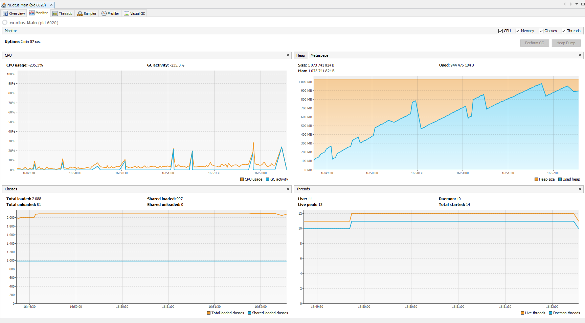
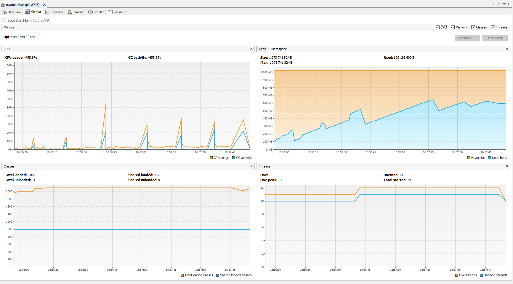
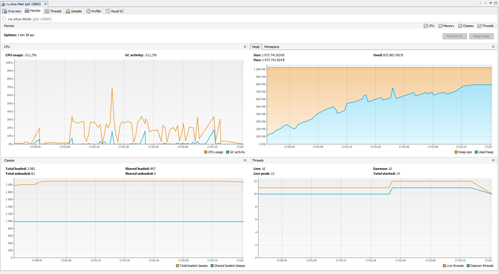
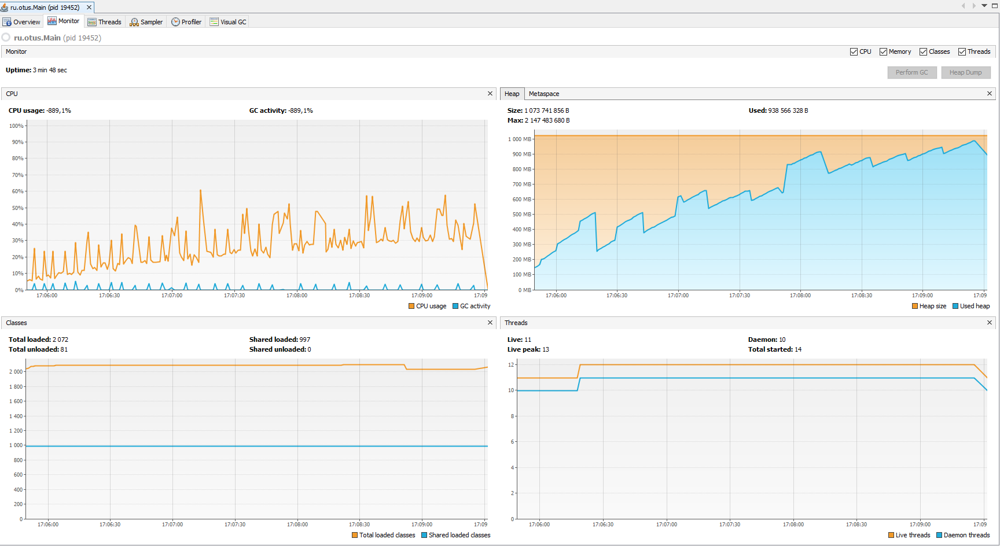

Отчет:

params for app:
`-Xms1024m -Xmx1024m`

#-XX:+UseSerialGC

```
Worked time: 176 sec
==============================Report==============================
All GC worked: 11731 ms
Count loop: 93377380
Copy: 6 times
MarkSweepCompact: 6 times
1 minute GC worked --> 1283 ms
2 minute GC worked --> 4203 ms
3 minute GC worked --> 6245 ms
```



#-XX:+UseParallelGC

```
Worked time: 121 sec
==============================Report==============================
All GC worked: 17458 ms
Count loop: 62251587
PS MarkSweep: 6 times
PS Scavenge: 8 times
1 minute GC worked --> 2948 ms
2 minute GC worked --> 14510 ms
```



#-XX:+UseConcMarkSweepGC

```
Worked time: 117 sec
==============================Report==============================
All GC worked: 57343 ms
Count loop: 62251587
ParNew: 6 times
ConcurrentMarkSweep: 16 times
1 minute GC worked --> 26410 ms
2 minute GC worked --> 30933 ms
```



#-XX:+UseG1GC

```
Worked time: 228 sec
==============================Report==============================
All GC worked: 7525 ms
Count loop: 93377380
G1 Young Generation: 35 times
G1 Old Generation: 2 times
1 minute GC worked --> 1995 ms
2 minute GC worked --> 1428 ms
3 minute GC worked --> 1168 ms
4 minute GC worked --> 2934 ms
```


Выводы:
Очевидно что с данной задачей на много лучше справился G1GC, если говорить о времени работы приложения. Приложение с ним отработало в 2 раза больше, по сравнению с коллегами =)
Так же G1 лидирует и по количеству запущенных процессов. 
```
G1 - > 37
CMS -> 22
Parallel -> 14
Serial -> 12 
```
Как результат на графике использование процессора на много выше, чем у его соратников.
Если обратить внимание на общее колличество времени потраченное на работу GC в целом, то тут так же лидирует G1, время работы которого в разы меньше чем у других.
```
G1 - > 7525 ms
CMS -> 57343 ms
Parallel -> 17458 ms
Serial -> 11731 ms
```
Можно сделать вывод, что G1 лучше остальных проявил себя в данном кейсе, если речь идет о времени работы приложения без OOM. На мой взгяд это связанно с тем, что большую часть работы он выполняет паралельно общему потоку приложения, как результат меньше времени тратится на SWT, но при этом задейсвуется больше ресурсов процессора. Отсутствие фрагментации памяти, так же является существенным плюсом этого сборщика мусора.
Но если говорить про объем выполненной работы за кратчайщий промежуток времени, здесь выигрывают ParallelGC и CMSGC
